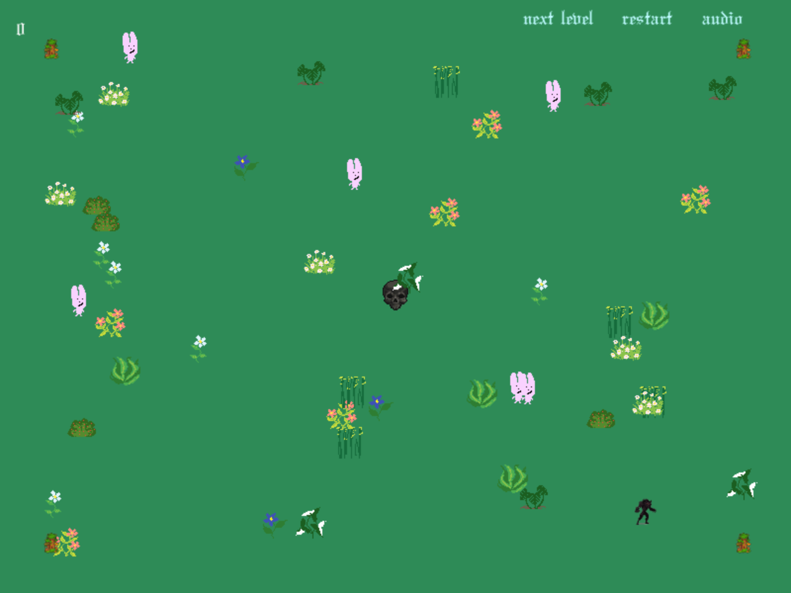

# Hunger. Chaos. Death.

A browser game about tending a flock you do not directly control. You plant food. The creatures, the hunters and the plants do the rest. Built with Phaser 3, Vite and TypeScript.


## How to play

- Click to plant a piece of foliage. Hold to lay down a thick trail.
- Creatures eat plants, speed up and breed. Hunters hunt creatures. Creatures flee to the homes in the four corners.
- A creature that reaches a home is saved and returns the next day. A creature caught by a hunter dies, and another hunter rises where it fell.
- Days are endless. The day you reach is your score. Survive a day with at least one creature saved and you roll into the next.



## Features

- Creatures that eat, breed and mutate, with survivors carrying their genes across days so the flock evolves.
- Hunters that spawn another hunter on every kill, so the threat compounds.
- Responsive on any screen, portrait or landscape, with touch support.
- A live config editor, an options panel and a local stats panel.

## Run it

You need [Node.js](https://nodejs.org).

```bash
npm install
npm run dev      # play at http://localhost:8080
npm run build    # production build into dist/
```

## Built with

- Phaser 3 for rendering, input, physics overlaps and tweens.
- easystarjs for grid pathfinding. The grid is rebuilt from the current foliage a few times a second, marking blocked cells.
- TypeScript, bundled by Vite.

Source lives in `src/scenes`. `GameScene` runs the round and the UI, `entities.ts` holds the creature and hunter behaviour, `GameManager` keeps every tunable value in one place, and `utils.ts` has the pathfinding helpers.

## Credits

Started from the official [Phaser 3 + Vite + TypeScript template](https://github.com/phaserjs/template-vite-ts). Game design, art, sound and code are my own.

## License

MIT. See `LICENSE`.
