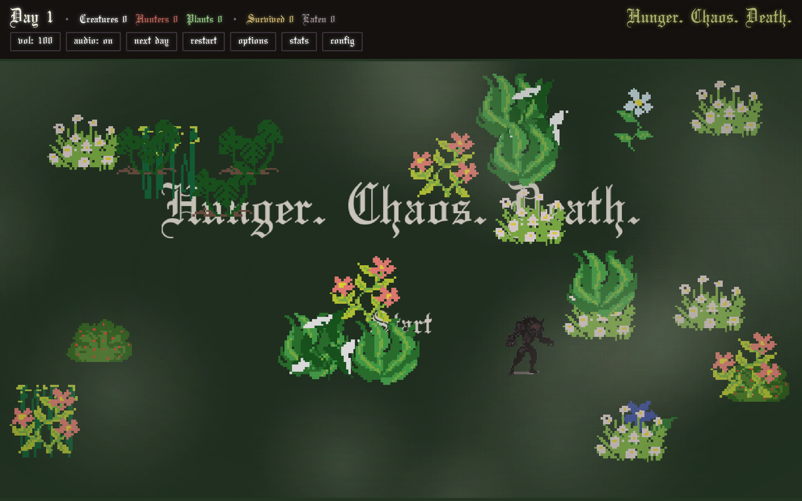

# Hunger. Chaos. Death.

An art game about life.

[**Play**](https://mattt.net.au/hungerchaosdeath/) · Phaser 3 · Vite · TypeScript



## About

A field of creatures, plants and hunters. Creatures graze, and a creature that
eats enough breeds. Offspring carry mutated genes, so speed, appetite, size and
colour shift across generations, and survivors pass their genes to the next day.
Hunters move toward the nearest creature and multiply with each kill. Plants
spread, are grazed back, and spread again; where they stand, they become terrain.

The player can plant food and attempt to influence. The rest is emergent.

## Develop

```bash
npm install
npm run dev     # http://localhost:8080
npm run build   # builds to dist/
```

## Stack

Phaser 3 for rendering, input and physics. easystarjs for grid pathfinding.
TypeScript, bundled with Vite. No UI framework.

## License

MIT. See `LICENSE`.
